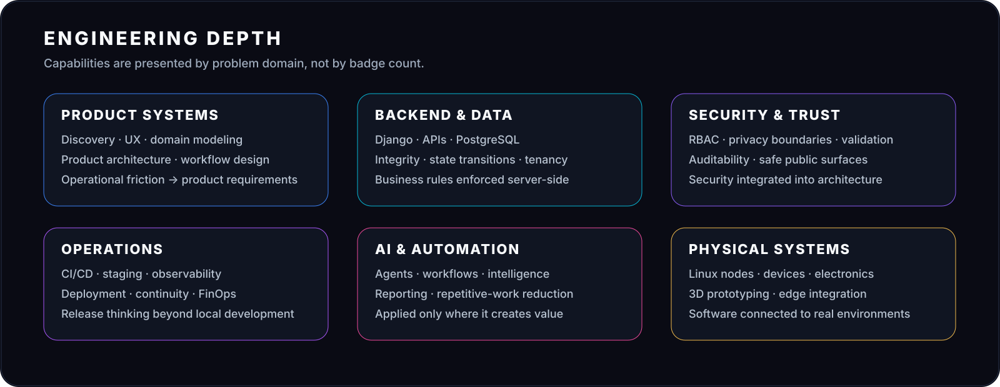
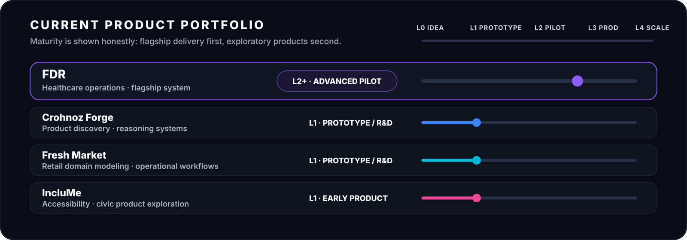

### Enrique Flores · Founder · Product & Systems Architect

# Convierto problemas operacionales reales en sistemas que funcionan.

**Ingeniería de producto · Backend · Operaciones seguras · IA aplicada · Integración de hardware**

**Chile → Global · Problema → Sistema → Evidencia → Escala**

 

  

[English](README.md) · **Español** · [中文](README.zh-CN.md) · [Sistema de marca](brand/README.md)

---

## Sistema insignia

### **[ABRIR CASO DE INGENIERÍA FDR →](evidence/fdr.md)**

`L2+ · PILOTO AVANZADO / ORIENTADO A PRODUCCIÓN`

FDR es actualmente el sistema más maduro del portafolio Crohnoz. Es la referencia principal para mostrar cómo abordo **modelado de dominio, límites público/privado, integridad backend, lifecycle operacional, regresiones, staging y delivery controlado**.

El caso público está sanitizado: muestra decisiones de ingeniería y madurez sin exponer datos clínicos privados, credenciales, topología productiva ni implementación propietaria.

---

## Profundidad de ingeniería

El foco no está en cuántas tecnologías aparecen en una lista, sino en si esas tecnologías hacen cumplir **contratos operacionales reales**: scope correcto, transiciones confiables, privacidad, continuidad y controles de delivery medibles.

---

## Modelo operativo Crohnoz

Crohnoz Labs es el ecosistema de ingeniería de producto que utilizo para pasar desde el entendimiento operacional hasta sistemas validados.

**DESCUBRIR → DISEÑAR → CONSTRUIR → VALIDAR → DESPLEGAR → OPERAR → MEJORAR**

---

## Portafolio actual

El modelo de madurez es deliberadamente explícito. **FDR es el flagship.** Forge, Fresh Market e IncluMe siguen siendo exploraciones de producto en etapas tempranas y no se presentan como referencias equivalentes de producción.

---

## Evidencia, no declaraciones

| Área de ingeniería | Qué debería demostrar un sistema real |
|---|---|
| **Modelado de dominio** | Las reglas del negocio existen como contratos explícitos y no como supuestos ocultos en la UI |
| **Integridad backend** | Operaciones inválidas o manipuladas son rechazadas en servidor |
| **Seguridad y privacidad** | Las superficies públicas exponen sólo lo que la operación realmente necesita |
| **Diseño de workflow** | Los estados y transiciones representan la operación real |
| **Confiabilidad** | Las regresiones codifican invariantes y modos de falla importantes |
| **Delivery** | Staging, release, observabilidad y continuidad son parte del producto |
| **Madurez** | Prototipo, piloto, producción y escala se distinguen honestamente |

### **[EXPLORAR TODA LA EVIDENCIA PÚBLICA →](evidence/README.md)**

---

## Cómo trabajo

| 01 | 02 | 03 | 04 | 05 | 06 | 07 |
|---|---|---|---|---|---|---|
| **Entender** | **Modelar** | **Diseñar** | **Construir** | **Validar** | **Operar** | **Mejorar** |
| Operación real | Reglas de dominio | Límites del sistema | Incremento útil | Flujos reales | Delivery seguro | Iteración con evidencia |

Prefiero entender la operación antes de elegir la arquitectura, reducir la carga cognitiva de quien usa el sistema y tratar seguridad, privacidad, pruebas, despliegue y continuidad como parte del producto.

---

## Superficie de ingeniería

`Django / DRF` · `PostgreSQL` · `REST APIs` · `RBAC` · `pytest` · `Ruff` · `CI/CD` · `Observabilidad` · `Automatización` · `IA aplicada` · `Integración de hardware`

---

### Crohnoz Labs

**Tecnología que resuelve problemas reales.**

`BUILD` · `INTEGRATE` · `AUTOMATE` · `OBSERVE` · `PROTECT` · `IMPROVE`

 

