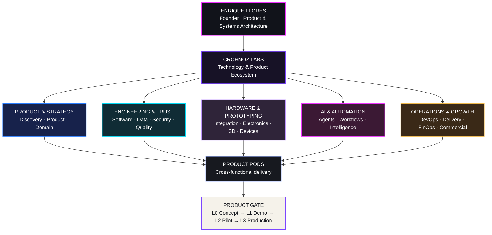

# Enrique Flores

### Product & Systems Architect · Founder, Crohnoz Labs

**Software · Hardware · Product Engineering · Applied AI · Automation · Secure Systems**

🇨🇱 **Convierto problemas operacionales reales en sistemas útiles, medibles y mantenibles.**  
🇬🇧 **I turn real operational problems into useful, measurable and maintainable systems.**  
🇨🇳 **我把真实运营问题转化为可用、可衡量、可维护的系统。**

[🇨🇱 Español](#español) · [🇬🇧 English](#english) · [🇨🇳 中文](#中文)

[Crohnoz Labs](https://crohnozlabs.cl) · [Professional profile](https://crohnozlabs.cl/profile) · [中文资料](https://crohnozlabs.cl/profile?lang=zh) · [Public repositories](https://github.com/Crohnoz?tab=repositories)

**Chile → Global · Software ↔ Hardware · Build → Operate → Improve**

---

## Crohnoz Labs · Ecosystem & organization map

Crohnoz Labs is a product-engineering ecosystem. Software, hardware, product, automation, security and operations share one engineering foundation instead of living as isolated projects.

### At a glance

| Area | What it means |
|---|---|
| **Software Engineering** | Python, Django/DRF, React, APIs, business systems, operational interfaces |
| **Hardware & Prototyping** | Electronics, device integration, 3D printing, practical prototypes |
| **Product & Systems** | Discovery, UX, architecture, service and operational modeling |
| **Automation & Data** | PostgreSQL, workflows, traceability, reporting and process automation |
| **AI + Security** | Applied AI, Linux, security-by-design, defensive engineering |
| **International Collaboration** | Technology sourcing, integration and cross-market product collaboration |

---

## Public evidence · Evidencia pública · 公开技术证据

Selected public repositories provide inspectable evidence without exposing private infrastructure, client systems or internal commercial logic.

- [Crohnoz-Forge](https://github.com/Crohnoz/Crohnoz-Forge) — product lab / incubation
- [Crohnoz-FreshMarket](https://github.com/Crohnoz/Crohnoz-FreshMarket) — product & operations
- [Crohnoz-Systems](https://github.com/Crohnoz/Crohnoz-Systems) — systems engineering
- [IncluMe](https://github.com/Crohnoz/IncluMe) — accessibility-oriented project
- [CV-Ciberseguridad](https://github.com/Crohnoz/CV-Ciberseguridad) — cybersecurity evidence
- [portalnoviciado](https://github.com/Crohnoz/portalnoviciado) — public web system

> **Public by design, private by default:** source is exposed only when it is intentionally suitable for public review. Private repositories, client environments, credentials, production topology and sensitive implementation details remain private.

---

## Español

### Qué construyo

Soy Enrique Flores, fundador de **Crohnoz Labs**. Trabajo en la intersección entre ingeniería de software, arquitectura de producto, automatización, IA aplicada, seguridad, infraestructura y prototipado tecnológico.

Mi foco no es producir software por producirlo: parto desde un problema real, entiendo la operación, diseño una solución, construyo una implementación verificable y la mejoro con evidencia de uso.

**Áreas principales:**

- arquitectura backend y APIs;
- productos full-stack y herramientas operacionales;
- automatización, datos y trazabilidad;
- ciberseguridad integrada al desarrollo;
- infraestructura Linux, contenedores y despliegue;
- hardware, prototipado e integración software ↔ dispositivo;
- IA aplicada a problemas concretos;
- diseño de productos y sistemas mantenibles.

### Dirección internacional

Crohnoz Labs está preparado para colaborar fuera de Chile en **software, hardware, integración tecnológica y desarrollo de producto**. La orientación internacional busca construir relaciones técnicas y comerciales verificables, sin presentar alianzas o capacidades que todavía no existan.

---

## English

### What I build

I am Enrique Flores, founder of **Crohnoz Labs**. My work sits at the intersection of software engineering, product architecture, automation, applied AI, security, infrastructure and technology prototyping.

I do not build software for its own sake. I start from a real problem, understand the operation, design the system, ship a verifiable implementation and improve it from evidence.

**Core areas:**

- backend architecture and APIs;
- full-stack products and operational tooling;
- automation, data and traceability;
- security integrated into product engineering;
- Linux infrastructure, containers and delivery;
- hardware prototyping and software ↔ device integration;
- applied AI for concrete problems;
- maintainable product and systems architecture.

### International direction

Crohnoz Labs is open to international collaboration across **software, hardware, technology integration and product development**. The goal is to build verifiable technical and commercial relationships without overstating partnerships or capabilities that do not yet exist.

---

## 中文

### 我做什么

我是 **Enrique Flores**，**Crohnoz Labs** 的创始人。我的工作位于软件工程、产品架构、自动化、应用型人工智能、网络安全、基础设施和技术原型设计的交叉领域。

我的目标不是为了写代码而写代码。我从真实问题出发，理解实际运营流程，设计系统，构建可验证的实现，并根据真实使用数据持续改进。

**主要方向：**

- 后端架构与 API；
- 全栈产品与运营工具；
- 自动化、数据与可追溯性；
- 将安全能力融入产品工程；
- Linux 基础设施、容器与部署；
- 硬件原型与软件 ↔ 设备集成；
- 面向实际问题的人工智能应用；
- 可维护的产品与系统架构。

### 国际合作方向

Crohnoz Labs 对 **软件、硬件、技术集成和产品开发** 领域的国际合作持开放态度。目标是建立可验证、长期且务实的技术与商业合作关系，同时不会夸大尚未形成的合作伙伴关系或能力。

---

## Engineering surface

`Python` · `Django / DRF` · `PostgreSQL` · `React` · `JavaScript` · `Docker` · `Linux` · `REST APIs` · `RBAC` · `CI/CD` · `pytest` · `Ruff` · `Automation` · `Applied AI`

---

## Engineering principles

1. **Understand the operation before choosing the architecture.**
2. **Reduce cognitive load for the person doing the work.**
3. **Treat security and privacy as architecture concerns.**
4. **A real product includes testing, deployment, documentation and continuity.**
5. **Ship increments, observe use, measure friction and improve continuously.**
6. **Expose capability publicly; keep proprietary implementation private.**

---

### Crohnoz Labs

**Product engineering for real operations · Chile → World**

[Website](https://crohnozlabs.cl) · [Profile ES](https://crohnozlabs.cl/perfil) · [Profile EN](https://crohnozlabs.cl/profile) · [中文](https://crohnozlabs.cl/profile?lang=zh)

`BUILD` · `INTEGRATE` · `AUTOMATE` · `OBSERVE` · `PROTECT` · `IMPROVE`

