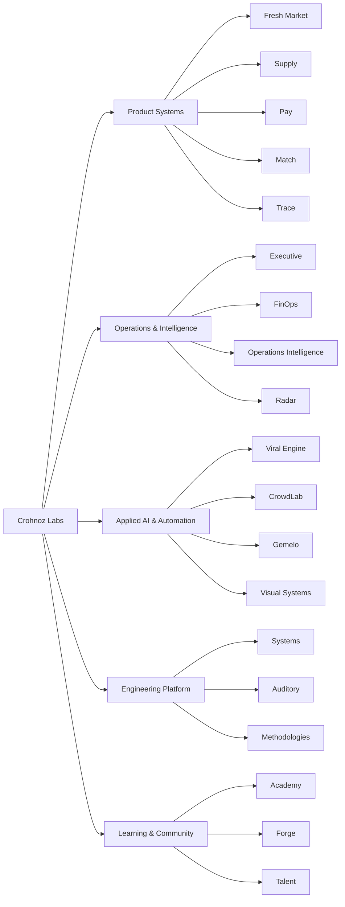

# Enrique Flores

### Product & Systems Architect · Crohnoz Labs

**Operational software · Applied AI · Automation · Secure systems · Product engineering**

I design and build software ecosystems that turn real operational problems into usable, measurable products.

[Crohnoz Labs](https://crohnozlabs.cl) · [Public work](#selected-public-surface) · [Engineering](#engineering-surface)

---

## Crohnoz Labs

Crohnoz Labs is the umbrella under which I build and evolve product systems, internal platforms, automation, applied intelligence, operational tooling, and experimental products.

The work is intentionally broader than a conventional portfolio: products share engineering principles, reusable architecture, operational knowledge, security practices, and a continuous-improvement loop.

> **Build systems, not screenshots. Ship useful software, observe reality, improve the system.**

### Ecosystem map

The diagram is a public architectural view only. Internal infrastructure, client environments, credentials, production topology, private datasets, and sensitive implementation details are intentionally excluded.

---

## What I actually build

I work across the full product lifecycle rather than only the frontend/backend boundary:

- **Discovery & systems analysis** — real workflows, failure points, actors, constraints, risks, and operational bottlenecks.
- **Backend architecture** — domain models, APIs, authentication, authorization, auditability, asynchronous workloads, and integrations.
- **Product interfaces** — dashboards, guided workflows, operational views, internal tools, and role-oriented UX.
- **Data & intelligence** — reporting, operational metrics, traceability, decision support, and automation pipelines.
- **Security engineering** — least privilege, role separation, tenant/data isolation, secure defaults, input validation, logging, and review.
- **Delivery & operations** — containers, Linux services, CI/CD, testing, documentation, staged deployments, and continuous improvement.

---

## Selected Crohnoz Labs surface

| System / area | Purpose | Visibility |
| --- | --- | --- |
| **Crohnoz Academy** | Role-based learning, guided training and practical upskilling | Private platform |
| **Crohnoz Forge** | Incubation space for ideas, prototypes and product experiments | [Public repository](https://github.com/Crohnoz/Crohnoz-Forge) |
| **Crohnoz Fresh Market** | Guided inventory and store operations | [Public repository](https://github.com/Crohnoz/Crohnoz-FreshMarket) · [Demo](https://crohnozfreshmarket.netlify.app) |
| **Crohnoz Systems** | Shared systems engineering and reusable product foundations | [Public repository](https://github.com/Crohnoz/Crohnoz-Systems) |
| **Crohnoz Talent** | Talent workflows and opportunity matching | Private product |
| **Crohnoz Executive** | Executive visibility and operational decision support | Private platform |
| **Crohnoz CrowdLab** | Public-signal observation, research and validation workflows | Private R&D |
| **Crohnoz FinOps** | Cost visibility and operational technology spend control | Private internal system |
| **Crohnoz Radar** | Monitoring and opportunity-detection workflows | Private internal system |
| **Viral Engine** | Distributed content-generation and processing workflows | Private R&D |
| **Crohnoz Trace** | Audit-oriented custody, evidence and traceability workflows | Private system |
| **IncluMe Chile** | Accessibility-oriented discovery and community tooling | [Public repository](https://github.com/Crohnoz/IncluMe) · [Demo](https://inclume-chile.netlify.app) |

This is a curated subset of a larger repository portfolio spanning production systems, prototypes, research, internal tooling, operational software, and reusable engineering components.

---

## Engineering surface

### Architecture & backend

`Python` · `Django` · `Django REST Framework` · `PostgreSQL` · `Celery` · `Redis` · `REST APIs` · `RBAC` · `multi-tenant patterns`

### Product & frontend

`JavaScript` · `React` · `HTML/CSS` · `responsive interfaces` · `role-oriented dashboards` · `accessible workflows`

### Platform & delivery

`Docker` · `Linux` · `Git` · `CI/CD` · `staging environments` · `service deployment` · `observability` · `operational documentation`

### Quality & security

`pytest` · `Ruff` · `code review` · `least privilege` · `audit trails` · `data isolation` · `secure-by-default design` · `defensive validation`

---

## Selected public surface

These repositories and deployments are intentionally public. Commercial systems, internal platforms, client work, infrastructure, private datasets, and security-sensitive implementation remain private.

- [Crohnoz Forge](https://github.com/Crohnoz/Crohnoz-Forge) — product incubation and experimentation.
- [Crohnoz Fresh Market](https://github.com/Crohnoz/Crohnoz-FreshMarket) — operational product for inventory-driven retail workflows.
- [Crohnoz Systems](https://github.com/Crohnoz/Crohnoz-Systems) — systems engineering work and shared foundations.
- [IncluMe](https://github.com/Crohnoz/IncluMe) — accessibility and community-oriented software.
- [Crohnoz.github.io](https://github.com/Crohnoz/Crohnoz.github.io) — earlier public web work and portfolio history.

---

## Engineering principles

1. **Understand the operation before choosing the architecture.**
2. **Prefer systems that reduce cognitive load for the person doing the work.**
3. **Security and privacy are architecture concerns, not a final checklist.**
4. **A useful product includes deployment, testing, documentation and continuity.**
5. **Ship increments, observe real use, measure friction, improve continuously.**
6. **Keep sensitive systems private while exposing enough evidence to demonstrate capability.**

---

## Public / private boundary

GitHub is the **showroom**, not the production control room.

Public material can demonstrate product thinking, architecture, interfaces, engineering practices, selected source code, and synthetic workflows. It does **not** expose client data, private repositories, production configuration, infrastructure addresses, credentials, secrets, internal security findings, or operational access paths.

---

### Crohnoz Labs

**Product engineering for real operations.**

[Visit crohnozlabs.cl](https://crohnozlabs.cl)

`BUILD` · `AUTOMATE` · `OBSERVE` · `PROTECT` · `IMPROVE`

