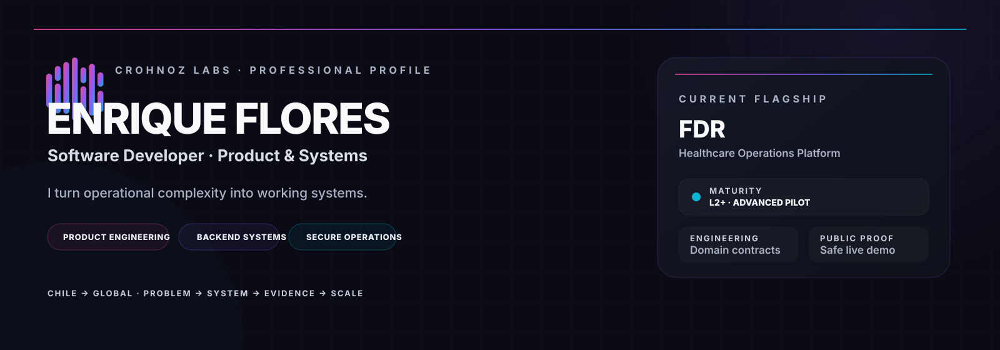
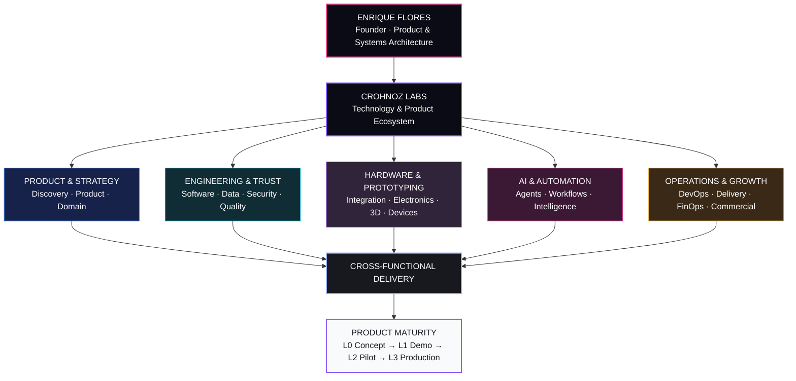

### Enrique Flores · Product & Systems Architect · Founder, Crohnoz Labs

**Software · Hardware · Product Engineering · Applied AI · Automation · Secure Systems**

[ES](README.es.md) · **EN** · [中文](README.zh-CN.md)

[Crohnoz Labs](https://crohnozlabs.cl) · [Professional profile](https://crohnozlabs.cl/profile) · [Public evidence](evidence/README.md) · [Brand System](brand/README.md)

**Chile → Global · Software ↔ Hardware · Build → Operate → Improve**

---

## Crohnoz Labs

**Tecnología que resuelve problemas reales.**

Crohnoz Labs is a product-engineering ecosystem built around a simple idea: understand a real operational problem, design the right system, ship a verifiable implementation, and improve it from evidence.

## Focus

| Engineering | Product | Physical systems | Operations |
|---|---|---|---|
| Python · Django · React · APIs | Discovery · UX · Architecture | Electronics · 3D · Device integration | Automation · Data · DevOps · FinOps |
| Security · Quality · PostgreSQL | Domain modeling · Product strategy | Connected prototypes | Observability · Delivery · Continuous improvement |

## What I build

- **Operational software** — applications, APIs, dashboards and role-oriented workflows.
- **Product systems** — architecture that connects users, processes, data and business rules.
- **Automation & intelligence** — workflows, reporting, traceability and applied AI where it provides concrete value.
- **Hardware integration** — practical prototypes, electronics, devices and software ↔ hardware interfaces.
- **Secure infrastructure** — Linux, containers, controlled deployments, continuity and security-by-design.

## Public evidence

Public evidence is curated as **case studies and demonstrations**, not as a dump of source repositories. The purpose is to show product thinking, architecture, engineering controls and operational understanding while keeping proprietary implementation private by default.

| Product | What it proves | Evidence |
|---|---|---|
| **Crohnoz Forge** | Discovery systems, local-first workflows, privacy and stage gates | [Case study](evidence/forge.md) · [Live demo](https://crohnoz-forge.netlify.app) |
| **Crohnoz Fresh Market** | Full-stack operational engineering, inventory rules, RBAC, traceability and continuity | [Case study](evidence/fresh-market.md) |
| **IncluMe** | Accessibility-oriented product design and citizen/municipal workflows | [Case study](evidence/inclume.md) · [Citizen demo](https://inclume-chile.netlify.app/) |

**[Open the complete Public Evidence catalog →](evidence/README.md)**

> **Evidence is public by design. Product implementation is private by default.** Client environments, credentials, production topology, databases, private datasets and internal repositories remain outside the public surface.

## Engineering surface

`Python` · `Django / DRF` · `PostgreSQL` · `React` · `JavaScript` · `Docker` · `Linux` · `REST APIs` · `RBAC` · `CI/CD` · `pytest` · `Ruff` · `Automation` · `Applied AI`

## Engineering principles

1. **Understand the operation before choosing the architecture.**
2. **Reduce cognitive load for the person doing the work.**
3. **Treat security and privacy as architecture concerns.**
4. **A real product includes testing, deployment, documentation and continuity.**
5. **Ship increments, observe use, measure friction and improve continuously.**
6. **Expose capability publicly; keep proprietary implementation private.**

---

### Crohnoz Labs

**Tecnología que resuelve problemas reales.**

`IDEAS` · `SOFTWARE` · `IMPACTO`

`BUILD` · `INTEGRATE` · `AUTOMATE` · `OBSERVE` · `PROTECT` · `IMPROVE`

[Website](https://crohnozlabs.cl) · [Profile](https://crohnozlabs.cl/profile) · [Evidence](evidence/README.md) · [Brand](brand/README.md)

