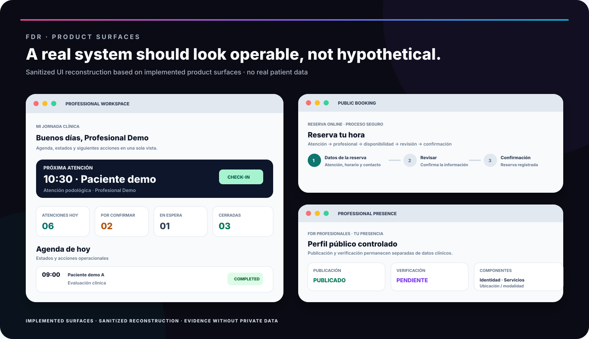
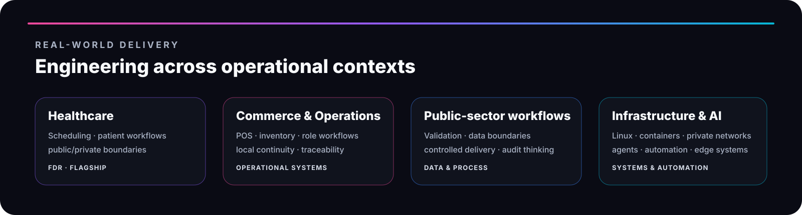
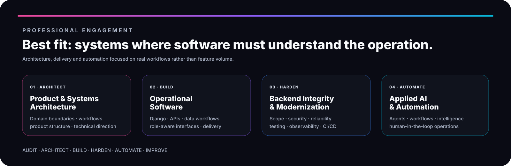

<picture>
  <source media="(max-width: 700px)" srcset="brand/assets/github-banner-mobile.svg" />
  
</picture>

 

  

**[ES](README.es.md) · EN · [中文](README.zh-CN.md) · [Brand System](brand/README.md)**

---

## Flagship system

<a href="evidence/fdr.md">
  <picture>
    <source media="(max-width: 700px)" srcset="brand/assets/fdr-flagship-mobile.svg" />
    
  </picture>
</a>

### **FDR · Healthcare Operations Platform**

`L2+ · ADVANCED PILOT / PRODUCTION-ORIENTED`

FDR is currently the strongest operational proof in the Crohnoz portfolio. It demonstrates **domain modeling, public/private boundaries, backend integrity, explicit workflow lifecycle, regression controls, reproducible staging and controlled delivery**.

---

## Product surfaces

<a href="https://crohnozlabs.cl/demos/fdr-centro-podologico">
  <picture>
    <source media="(max-width: 700px)" srcset="brand/assets/fdr-product-showcase-mobile.svg" />
    
  </picture>
</a>

**Professional workspace · Public booking · Professional presence**

The visual above is a **sanitized reconstruction based on implemented FDR interfaces**, not a fabricated screenshot. It uses demo labels and contains no real patient data.

---

## Engineering proof

The emphasis is on **behavior the system already enforces**, not roadmap claims: scoped booking, controlled publication, explicit state transitions, privacy boundaries, reproducible staging and targeted regressions.

---

## Engineering depth

A technology matters when it helps enforce a real operational contract. The profile therefore leads with **systems thinking and engineering outcomes**, not badge count.

---

## Real-world delivery

I work across domains where software must fit real operations: healthcare, commerce and operational systems, public-sector workflows, infrastructure and applied automation. Client-sensitive implementation remains private; transferable engineering patterns remain inspectable.

---

## Crohnoz operating model

### **DISCOVER → DESIGN → BUILD → VALIDATE → DEPLOY → OPERATE → IMPROVE**

---

## Current portfolio maturity

<picture>
  <source media="(max-width: 700px)" srcset="brand/assets/portfolio-maturity-mobile.svg" />
  
</picture>

The maturity map is intentionally honest. **FDR receives flagship weight because its operational evidence is materially stronger.** Earlier-stage systems remain visible without being presented as production-equivalent references.

---

## Professional collaboration

Best-fit work is where the main challenge is not simply shipping features, but **understanding an operation, translating it into explicit system behavior and delivering it with reliable boundaries**.

---

## Deep dive

<strong>Evidence, not claims · what I expect a real system to prove</strong>

 

| Engineering area | What a real system should prove |
|---|---|
| **Domain modeling** | Business rules exist as explicit contracts, not assumptions hidden in UI code |
| **Backend integrity** | Invalid or manipulated operations are rejected server-side |
| **Security & privacy** | Public surfaces expose only what the operation actually requires |
| **Workflow design** | States and transitions represent the real operation |
| **Reliability** | Regressions encode important invariants and failure modes |
| **Delivery** | Staging, release flow, observability and continuity are part of the product |
| **Product maturity** | Prototype, pilot, production and scale are distinguished honestly |

<strong>How I work · operating sequence</strong>

 

| 01 | 02 | 03 | 04 | 05 | 06 | 07 |
|---|---|---|---|---|---|---|
| **Understand** | **Model** | **Design** | **Build** | **Validate** | **Operate** | **Improve** |
| Real operation | Domain rules | System boundaries | Useful increment | Real workflows | Secure delivery | Evidence-driven iteration |

I prefer to understand the operation before choosing the architecture, reduce cognitive load for the person doing the work, and treat security, privacy, testing, deployment and continuity as product concerns rather than final checkboxes.

<strong>Engineering surface · technologies and controls</strong>

 

`Django / DRF` · `PostgreSQL` · `REST APIs` · `RBAC` · `pytest` · `Ruff` · `CI/CD` · `Observability` · `Automation` · `Applied AI` · `Hardware Integration`

 

---

### Crohnoz Labs

**Tecnología que resuelve problemas reales.**

`BUILD` · `INTEGRATE` · `AUTOMATE` · `OBSERVE` · `PROTECT` · `IMPROVE`

 

