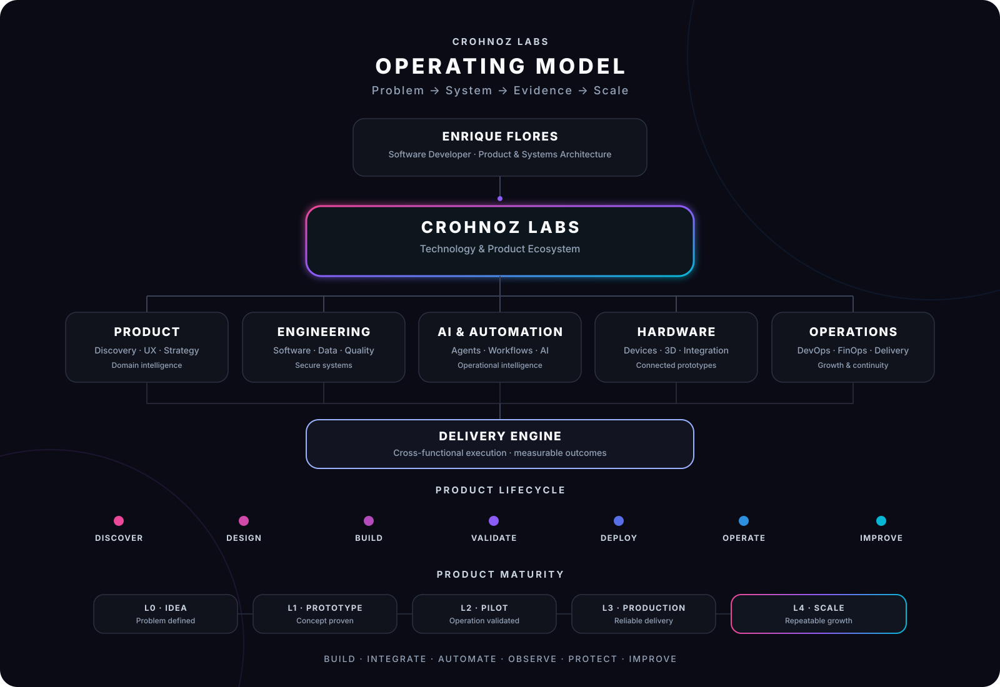
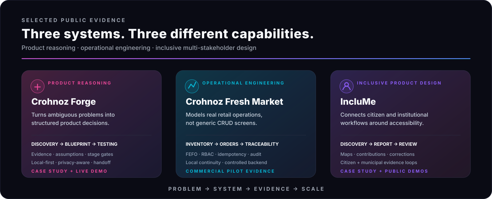

### Enrique Flores · Founder · Product & Systems Architect

**我设计将真实运营问题转化为可运行产品的系统。**

`产品工程` · `软件` · `硬件` · `应用型人工智能` · `自动化` · `安全系统`

[English](README.md) · [Español](README.es.md) · **中文**

[Crohnoz Labs](https://crohnozlabs.cl) · [专业资料](https://crohnozlabs.cl/profile?lang=zh) · [公开证据](evidence/README.md) · [品牌系统](brand/README.md)

**Chile → Global · Software ↔ Hardware · 问题 → 系统 → 证据 → 扩展**

---

## Crohnoz Labs

**用技术解决真实问题。**

Crohnoz Labs 是一个产品工程生态系统，专注于理解真实运营、设计正确的系统、交付可验证的实现，并根据证据持续改进。

## 我构建的系统

| 产品系统 | 工程 | 智能运营 | 物理系统 |
|---|---|---|---|
| 产品发现 · UX · 架构 · 领域建模 | Python · Django · API · 数据 · 安全 · 质量 | 自动化 · 智能代理 · 可观测性 · DevOps · FinOps | 电子 · 3D · 设备 · 软件 ↔ 硬件集成 |
| 将运营摩擦转化为产品需求 | 构建具有可衡量控制的可靠系统 | 减少重复劳动并提高运营可见性 | 将软件连接到真实物理环境 |

## 精选公开证据

公开证据以**案例研究和可运行演示**的形式呈现。每个系统都代表 Crohnoz 运营模型中的不同能力。

**[Crohnoz Forge →](evidence/forge.md)** 产品推理 · **[Fresh Market →](evidence/fresh-market.md)** 运营工程 · **[IncluMe →](evidence/inclume.md)** 包容性产品设计

[Forge 在线演示](https://crohnoz-forge.netlify.app) · [IncluMe 市民端演示](https://inclume-chile.netlify.app/) · **[完整证据目录 →](evidence/README.md)**

> **证据按设计公开，实现默认私有。** 客户环境、凭据、生产拓扑、私人数据集和内部仓库不会进入公开展示层。

## 工程能力

`Python` · `Django / DRF` · `PostgreSQL` · `React` · `JavaScript` · `Docker` · `Linux` · `REST APIs` · `RBAC` · `CI/CD` · `pytest` · `Ruff` · `Automation` · `Applied AI`

## 运营原则

1. **在选择架构之前先理解真实运营。**
2. **降低实际使用系统人员的认知负担。**
3. **将安全、隐私和连续性视为架构问题。**
4. **小步交付、观察使用、衡量摩擦并持续改进。**
5. **公开展示能力，同时保护专有实现。**

---

### Crohnoz Labs

**技术解决真实问题。**

`BUILD` · `INTEGRATE` · `AUTOMATE` · `OBSERVE` · `PROTECT` · `IMPROVE`

[Website](https://crohnozlabs.cl) · [Profile](https://crohnozlabs.cl/profile?lang=zh) · [Evidence](evidence/README.md) · [Brand](brand/README.md)

