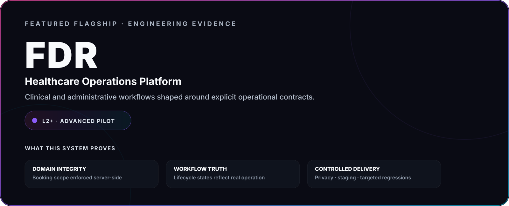
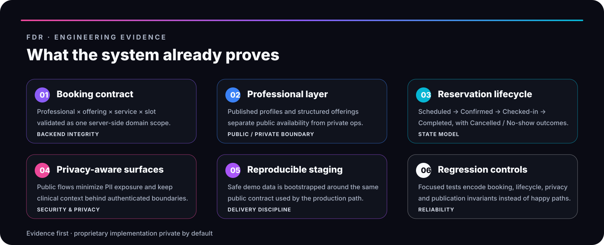

# Public Evidence

**Product thinking · Engineering depth · Operational systems · Honest maturity**

This directory is the curated public evidence layer for Enrique Flores / Crohnoz Labs. The goal is to demonstrate engineering capability **without publishing complete proprietary source code, private infrastructure, client environments or sensitive implementation details**.

---

## Flagship engineering case

`L2+ · ADVANCED PILOT / PRODUCTION-ORIENTED`

FDR is the current flagship reference for the Crohnoz operating model. It demonstrates production-oriented domain modeling, booking integrity, explicit workflow lifecycle, privacy boundaries, reproducible staging, focused regression coverage and controlled delivery.

---

## Selected operational engineering

### Rental Operations

A second operational case showing that the same engineering principles transfer beyond healthcare: explicit financial rules, payment evidence, exit settlement, public/private separation and database-level authorization.

This case is intentionally presented as a **selected operational system**, not as a flagship or finished multi-tenant SaaS product.

---

## Exploratory product evidence

These systems remain earlier in the maturity curve and are presented honestly as product exploration / R&D rather than equivalent production references.

| Product | Maturity | Evidence focus | Public surface |
|---|---|---|---|
| [Crohnoz Forge](forge.md) | `L1 · Prototype / R&D` | Product discovery, local-first workflow, privacy, stage gates | Public demo |
| [Crohnoz Fresh Market](fresh-market.md) | `L1 · Prototype / R&D` | Retail operations, inventory, backend controls, traceability | Curated product surface |
| [IncluMe](inclume.md) | `L1 · Early Product` | Accessibility, civic UX, citizen + municipal workflows | Public demos |

---

## Evidence standard

Every public case should make the following clear:

1. **What real problem does this solve?**
2. **What operational context matters?**
3. **What system was designed?**
4. **Which engineering decisions are inspectable?**
5. **What evidence is safe to expose?**
6. **What remains intentionally private?**
7. **What maturity can honestly be claimed today?**

---

## Publication boundary

Public evidence may include sanitized architecture, product behavior, live demonstrations with fictitious data, security/reliability practices, non-sensitive metrics, engineering decisions and honest maturity status.

It should not include secrets, credentials, production databases, customer data, private topology, complete proprietary implementations or client-confidential logic.

> **Evidence is public by design. Product implementation is private by default.**

