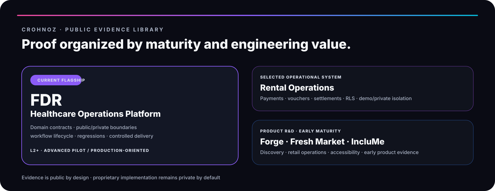
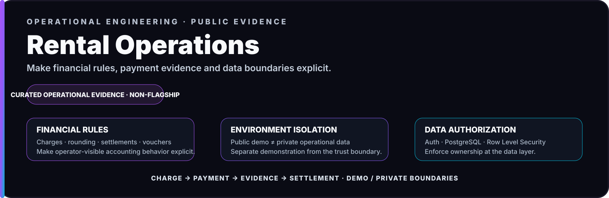
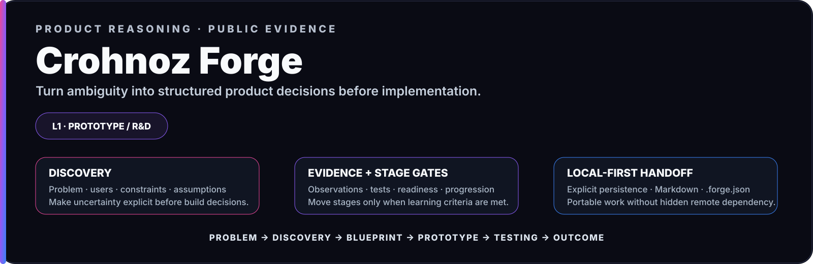
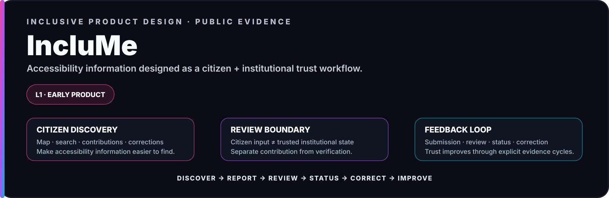

**[← Enrique Flores profile](../README.md) · [Crohnoz Labs](https://crohnozlabs.cl)**

 

# Public Evidence Library

**Product thinking · Engineering depth · Operational systems · Honest maturity**

This is the curated public evidence layer for Enrique Flores / Crohnoz Labs. It demonstrates engineering capability **without publishing complete proprietary source code, private infrastructure, client environments or sensitive implementation details**.

> **Evidence is public by design. Product implementation is private by default.**

---

## 01 · Flagship engineering case

<a href="fdr.md">
  <picture>
    <source media="(max-width: 700px)" srcset="../brand/assets/fdr-flagship-mobile.svg" />
    
  </picture>
</a>

FDR is the current flagship reference for the Crohnoz operating model. It demonstrates **domain integrity, booking scope, explicit workflow lifecycle, privacy boundaries, reproducible staging and targeted regression coverage**.

---

## 02 · Selected operational engineering

<a href="rental-operations.md">
  <picture>
    <source media="(max-width: 700px)" srcset="../brand/assets/case-rental-operations-mobile.svg" />
    
  </picture>
</a>

Rental Operations shows the same engineering approach beyond healthcare: explicit financial rules, payment evidence, settlement behavior, public/private separation and database-level authorization.

**[Engineering case →](rental-operations.md) · [Public repository →](https://github.com/Crohnoz/Crohnoz-Rental-Ops)**

---

## 03 · Product R&D

These systems remain earlier in the maturity curve. They are visible because each proves a different capability—not because a polished interface makes them production-equivalent.

### Crohnoz Forge · Product reasoning

<a href="forge.md">
  <picture>
    <source media="(max-width: 700px)" srcset="../brand/assets/case-forge-mobile.svg" />
    
  </picture>
</a>

**[Case study →](forge.md) · [Public demo →](https://crohnoz-forge.netlify.app)**

### Crohnoz Fresh Market · Operational domain modeling

<a href="fresh-market.md">
  <picture>
    <source media="(max-width: 700px)" srcset="../brand/assets/case-fresh-market-mobile.svg" />
    
  </picture>
</a>

**[Case study →](fresh-market.md)**

### IncluMe · Inclusive multi-stakeholder product design

<a href="inclume.md">
  <picture>
    <source media="(max-width: 700px)" srcset="../brand/assets/case-inclume-mobile.svg" />
    
  </picture>
</a>

**[Case study →](inclume.md) · [Citizen demo →](https://inclume-chile.netlify.app/)**

---

## Portfolio maturity summary

| System | Public position | Evidence focus |
|---|---|---|
| **FDR** | `L2+ · Advanced Pilot` | Domain integrity · privacy · lifecycle · staging · regressions |
| **Rental Operations** | Selected operational evidence | Financial rules · traceability · Auth/RLS · environment isolation |
| **Crohnoz Forge** | `L1 · Prototype / R&D` | Discovery · assumptions · stage gates · local-first handoff |
| **Crohnoz Fresh Market** | `L1 · Prototype / R&D` | Perishable inventory · write integrity · continuity |
| **IncluMe** | `L1 · Early Product` | Accessibility · citizen/institutional workflow · feedback loop |

The hierarchy is deliberate: **visual quality does not upgrade maturity**. A system advances only when operational evidence supports the claim.

---

## Evidence standard

<strong>What every public case should make clear</strong>

 

1. What real problem does this solve?
2. What operational context matters?
3. What exists today?
4. Which engineering decisions are inspectable?
5. What evidence is safe to expose?
6. What remains intentionally private?
7. What maturity can honestly be claimed today?
8. What evidence is required for the next maturity gate?

<strong>Publication boundary</strong>

 

Public evidence may include sanitized architecture, implemented behavior, fictitious-data demos, sanitized product-surface reconstructions, security/reliability practices and honest maturity status.

It should not include secrets, credentials, production databases, customer data, private topology, complete proprietary implementations or client-confidential logic.

---

### **Problem → System → Evidence → Scale**

[Enrique Flores profile](../README.md) · [Professional profile](https://crohnozlabs.cl/profile) · [Crohnoz Labs](https://crohnozlabs.cl)

