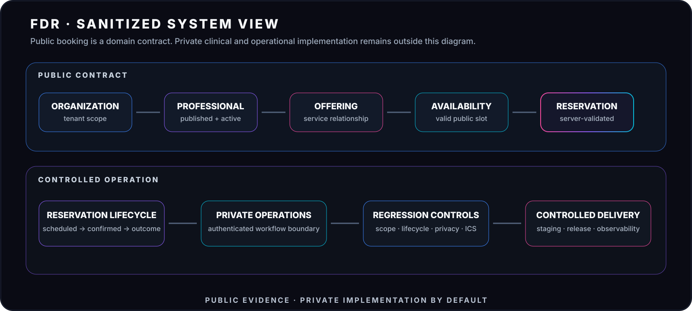

  

# FDR · Flagship Engineering Case Study

`L2+ · ADVANCED PILOT / PRODUCTION-ORIENTED`

**Healthcare operations · domain integrity · privacy · workflow lifecycle · controlled delivery**

> This case study is intentionally sanitized. It documents engineering decisions and observable product behavior without exposing private clinical data, credentials, production topology, private repositories or client-sensitive implementation details.

---

## Safe public demo

### **[OPEN THE FDR SAFE LIVE DEMO →](https://crohnozlabs.cl/demos/fdr-centro-podologico)**

The public demo uses **fictitious patients, appointments and workflow states**. It is designed as a safe product walkthrough and does not connect visitors to the real clinical platform or expose operational data.

That distinction is part of the evidence itself: demonstrating a product should not require weakening the production privacy boundary.

---

## Engineering proof at a glance

---

## Why FDR matters

FDR is a healthcare operations platform designed around real clinical and administrative workflows rather than a generic CRUD model. The system connects public booking, professional availability, patient operations, clinical workflow boundaries and controlled delivery.

It is currently the most mature system in the Crohnoz portfolio and the primary reference for production-oriented engineering practices.

---

## System view

The central design principle is simple: **public booking is a domain contract, not a front-end form**.

A valid reservation depends on several conditions being true at the same time:

- correct organization scope;
- active professional;
- published public profile;
- acceptance of new patients;
- active and publicly bookable service;
- real professional ↔ service offering;
- valid availability in the same scope.

The backend enforces that relationship rather than trusting UI state.

---

## Public booking contract

### `Organization → Professional → Service Offering → Availability → Reservation`

Server-side validation prevents manipulated requests from selecting a professional, service or slot outside the allowed scope. The UI is a projection of the domain contract, not the source of truth.

### What this proves

| Control | Engineering meaning |
|---|---|
| **Organization scope** | Public selection cannot cross the intended operational boundary |
| **Published professional** | Internal records do not automatically become public availability |
| **Structured offering** | A public service must actually be offered by the selected professional |
| **Scoped availability** | A slot is only valid inside the same professional/service relationship |
| **Server validation** | Manipulated client input does not redefine business rules |

---

## Reservation lifecycle

FDR models operational states explicitly instead of collapsing the workflow into a generic `confirmed = true/false` flag.

### `SCHEDULED → CONFIRMED → CHECKED_IN → COMPLETED`

`CANCELLED · NO_SHOW`

Calendar exports also reflect the actual reservation state. A newly created reservation is not automatically represented as confirmed simply because an event exists.

This matters because system state, UI language and calendar semantics should describe the same operational truth.

---

## Public / private boundary

The platform separates public discovery and booking surfaces from authenticated operational views.

Public interactions are designed to minimize unnecessary exposure of patient contact information or internal clinical context. Professional public profiles and service offerings are modeled as explicit publication data instead of being inferred directly from internal operational records.

That separation allows the public product to evolve without treating the private clinical model as a public API by accident.

---

## Reliability and regression thinking

FDR includes targeted regression coverage for domain invariants such as:

- professional × service × availability scope;
- rejection of manipulated public booking requests;
- reservation lifecycle behavior;
- calendar / ICS status mapping;
- privacy behavior on public booking surfaces;
- professional-profile publication behavior;
- reproducible staging data aligned with the public booking contract.

The approach favors **narrow regressions around important invariants** rather than relying only on broad happy-path testing.

---

## Delivery model

The project uses a controlled release workflow with a dedicated production-oriented branch and focused pull requests. Staging data is generated through reproducible bootstrap logic rather than unmanaged manual fixtures.

CI is also treated as an operational resource: coverage, execution cost and redundant automation are managed intentionally instead of assuming infinite compute or unlimited build minutes.

---

## Engineering evidence

| Capability | Publicly describable evidence |
|---|---|
| **Domain modeling** | Booking requires a valid organization, professional, offering, service and slot relationship |
| **Backend integrity** | Invalid manipulated selections are rejected server-side |
| **Workflow design** | Explicit reservation lifecycle instead of generic confirmation flags |
| **Privacy thinking** | Public surfaces minimize unnecessary personal-data exposure |
| **Product architecture** | Public directory, booking and private operations use controlled boundaries |
| **Testing discipline** | Regression suites encode operational invariants |
| **Delivery engineering** | Staging, controlled releases and CI resource management are part of the system |

---

## Current maturity

### `L0 IDEA → L1 PROTOTYPE → L2 PILOT → ● L2+ ADVANCED PILOT → L3 PRODUCTION → L4 SCALE`

FDR is represented as **L2+ Advanced Pilot / Production-Oriented**, not as a fully proven L3/L4 system.

That distinction is intentional. The platform already demonstrates substantial production-oriented engineering and real operational depth, while still leaving room for additional hardening, longer-term production evidence, scale validation and operational metrics before claiming full production maturity.

---

## Crohnoz reference

FDR is the current strongest example of the Crohnoz operating model:

# **Problem → System → Evidence → Scale**

