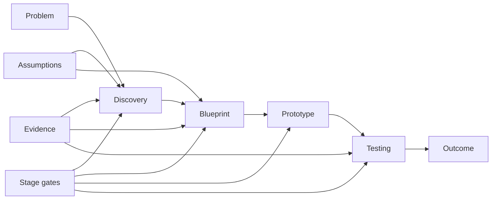

# Crohnoz Forge — Case Study

[← Public Evidence](README.md)

## Problem

Ideas often move into implementation before the problem, users, constraints, risks and success criteria are explicit. Crohnoz Forge is designed to make that reasoning visible before a project becomes expensive software.

## Product

Forge combines two complementary surfaces:

- a fast public workspace that converts a plain-language problem into an exploratory product blueprint;
- a local-first Studio that carries a project through a structured lifecycle:

`Raw → Discovery → Blueprint → Prototype → Testing → Outcome`

## What this demonstrates

- product discovery translated into a repeatable workflow;
- explicit assumptions, evidence and stage gates;
- readiness and next-action guidance;
- privacy-aware local-first operation;
- portable handoff artifacts instead of lock-in;
- product integrity: no undisclosed external AI dependency is claimed.

## Public architecture view

## Public evidence

- Public Forge: https://crohnoz-forge.netlify.app
- Forge Studio: https://crohnoz-forge.netlify.app/studio
- Privacy surface: https://crohnoz-forge.netlify.app/privacy

## What remains private by default

This case study does not require publishing private operational infrastructure, credentials, internal commercial processes, future proprietary services or any confidential project entered by a user.

## Why it matters

Forge is evidence of **product-system design**, not just interface implementation. It demonstrates how discovery, evidence, risk, privacy and handoff can be treated as part of the product itself.
