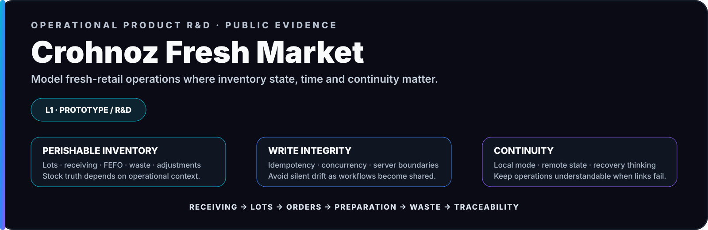

  

<picture>
  <source media="(max-width: 700px)" srcset="../brand/assets/case-fresh-market-mobile.svg" />
  
</picture>

# Crohnoz Fresh Market · Operational Product R&D

`L1 · PROTOTYPE / R&D`

**Perishable inventory · traceability · role workflows · continuity · backend controls**

> Fresh Market is an early operational-product prototype. It explores demanding retail-domain rules, but it is **not** presented as a validated production deployment.

---

## Problem

Fresh-food retail combines inventory, variable quantities, receiving, pricing, spoilage, customer accounts, cash reconciliation and continuous operational decisions. A generic CRUD model does not describe that environment well enough.

## What exists today

The prototype explores a vertical operating model for greengrocers and fresh-product retailers, combining a local operating mode with a Django-oriented backend design for controlled remote operations.

Its current value is the **domain and integrity work already modeled/prototyped**, not a claim of production adoption.

## Engineering concepts already explored

| Area | Prototype evidence |
|---|---|
| **Perishable inventory** | Lot-based stock and FEFO consumption rules |
| **Traceability** | Receiving, movement history and operational audit concepts |
| **Access control** | Role-oriented workflows and organization boundaries |
| **Write integrity** | Idempotency, optimistic-concurrency and server-side recalculation concepts |
| **Order operations** | Preparation and actual-quantity reconciliation |
| **Continuity** | Explicit local/remote state and degraded-mode thinking |

## Sanitized system view

### `OPERATOR → OPERATIONAL UI → LOCAL CONTINUITY / AUTHENTICATED BACKEND`

`INVENTORY · LOTS · ORDERS · TRACEABILITY · ROLE CONTROLS`

## Current maturity

Fresh Market is **L1 Prototype / R&D**. Although parts of the design are production-oriented, deployability alone is not treated as proof of operational maturity.

The next maturity gate is a constrained real-world pilot with representative inventory, receiving, order and reconciliation workflows; measured operator feedback; and validated recovery/continuity behavior.

### What is not claimed

- production-grade retail deployment;
- validated multi-store scale;
- proven long-term inventory accuracy;
- mature commercial adoption;
- complete operational observability.

## Public evidence boundary

The case exposes the problem, operating model, architectural controls and current maturity. Complete backend implementation, database structure, deployment configuration, credentials, proprietary business logic and real operational data remain private by default.

## Why it remains useful evidence

Fresh Market demonstrates the ability to identify **where a vertical domain stops being CRUD and starts requiring explicit operational contracts**. That distinction is valuable even while the product remains early-stage.

---

**Prototype honestly · validate before claiming production.**

