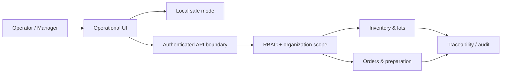

# Crohnoz Fresh Market — Case Study

[← Public Evidence](README.md)

## Problem

Fresh-food retail combines inventory, variable quantities, receiving, pricing, spoilage, customer accounts, cash reconciliation and day-to-day operational decisions. Generic CRUD software does not capture that operational reality well.

## Product

Crohnoz Fresh Market is a vertical product for greengrocers, produce stores and fresh-product retailers. It combines a complete local operating mode with a Django backend for controlled remote operations.

## What this demonstrates

- domain modeling for perishable inventory;
- lot-based inventory and FEFO consumption priority;
- receiving, movement history and traceability;
- role-based access control;
- idempotent write operations and optimistic concurrency controls;
- append-only audit concepts;
- order preparation and actual-quantity reconciliation;
- local continuity and explicit fallback when remote services are unavailable;
- separation between demo/local data and authenticated server data.

## Sanitized architecture view

## Engineering evidence

The product design includes controls for:

- organization-scoped access;
- inventory mutation versioning;
- retry-safe/idempotent operations;
- FEFO enforcement for perishable stock;
- immutable operational history;
- server-side recalculation of order totals and quantities;
- explicit distinction between local and remote state.

## Public evidence policy

The case study exposes the **problem, operating model, architectural controls and product maturity**. It does not need to expose the complete Django implementation, database schema, internal deployment configuration, credentials, private business logic or real operational data.

## Maturity

The product has been developed as a commercial pilot with a deployable Django backend and a local demo mode using safe data. Production readiness should always be evaluated separately from the existence of a deployable build.

## Why it matters

Fresh Market is evidence of **full-stack operational product engineering**: the value is not a screenshot or CRUD interface, but the way domain rules, data integrity, security and continuity are translated into a usable workflow.
