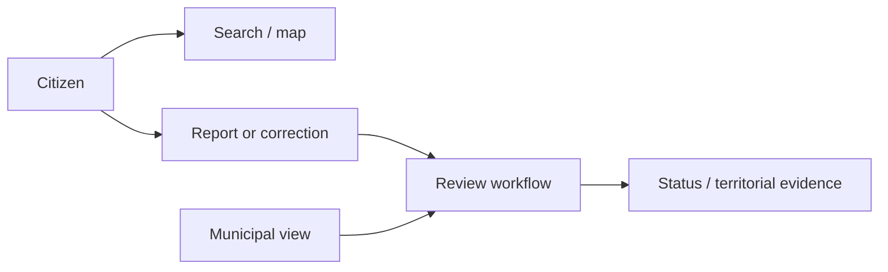

# IncluMe — Case Study

[← Public Evidence](README.md)

## Problem

Accessibility information is often fragmented, outdated or difficult to verify. IncluMe explores a civic workflow for finding, documenting and reviewing accessible parking information in Chile.

## Product

IncluMe separates two complementary experiences:

- a citizen-facing application for map-based discovery, search and community contributions;
- a municipal-facing surface for territorial review, indicators, submissions and export.

## What this demonstrates

- accessibility-oriented product framing;
- public + institutional workflows for the same domain;
- geographic information presented through user-centered interfaces;
- feedback and correction loops;
- separation of citizen contribution from municipal review;
- deployable public demonstrations rather than static portfolio screenshots.

## Public workflow

## Public evidence

- Citizen application: https://inclume-chile.netlify.app/
- Municipal demonstration: https://inclume-municipalidades.netlify.app/
- Feedback surface: https://inclume-chile.netlify.app/feedback/

## What remains private by default

A public accessibility demo does not require exposing private deployment credentials, moderation internals, sensitive user information, production datasets or proprietary service logic.

## Why it matters

IncluMe is evidence of **inclusive product design and multi-stakeholder workflow thinking**. It shows how a single domain can require different interfaces, responsibilities and evidence loops for citizens and institutions.
